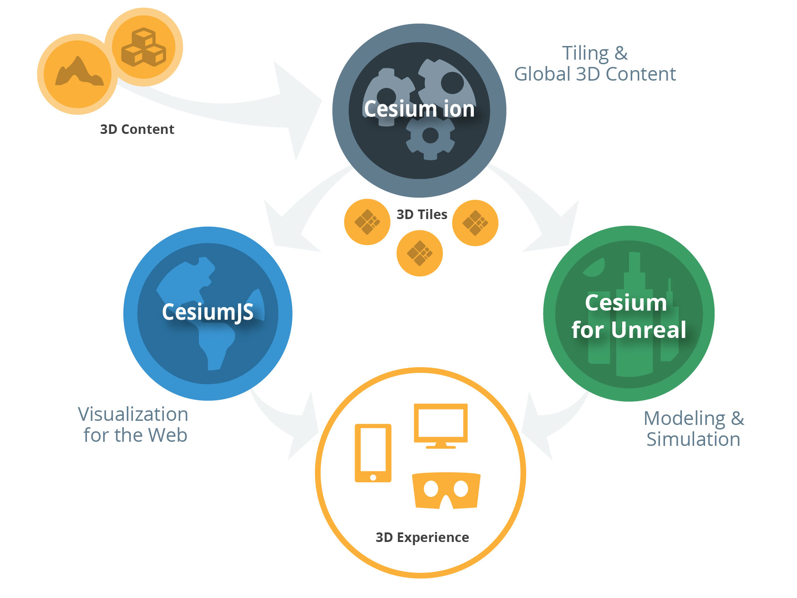
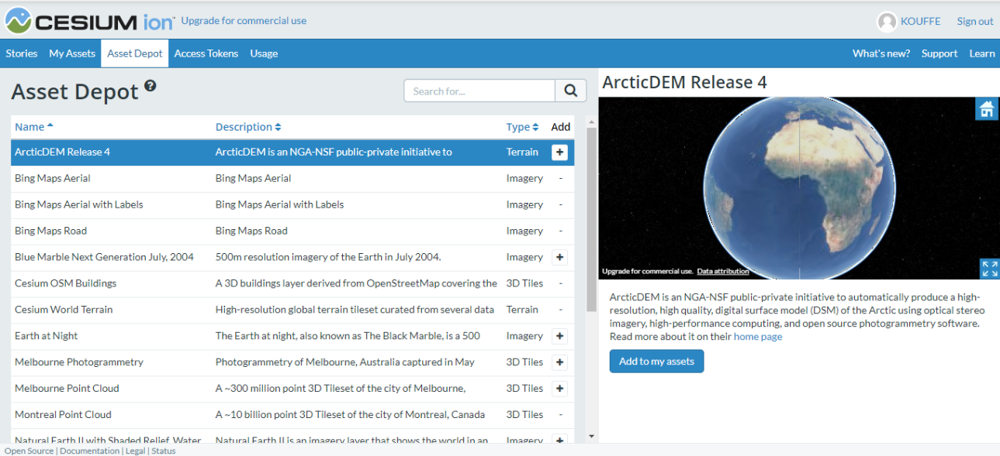
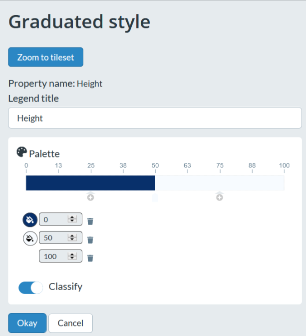
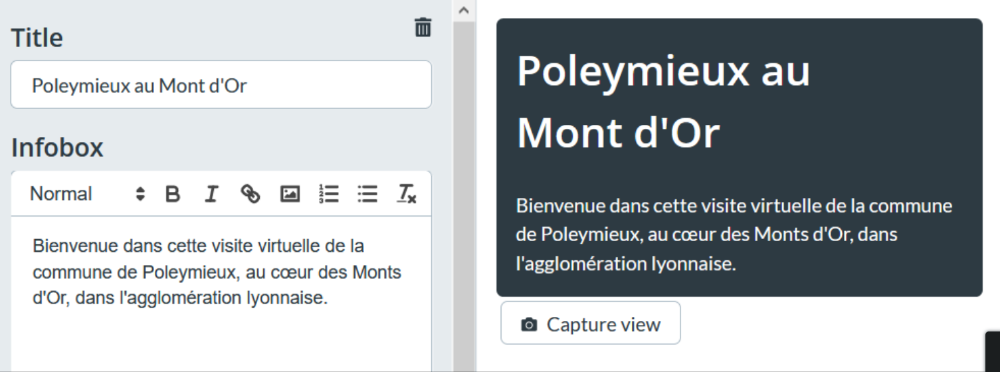
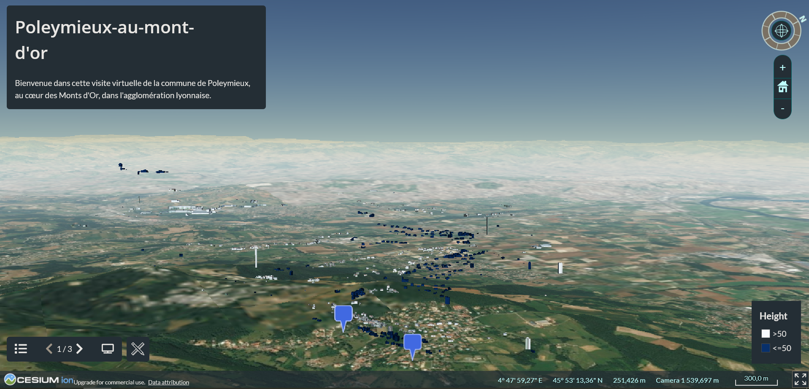

# Visualiser des données 3D et créer une présentation interactive avec Cesium ion

Cesium est une entreprise qui développe plusieurs outils de géovisualisation de données 3D qui sont :
CesiumJS : une bibliothèque opensource JavaScript de création de cartes et globes terrestres en 3D ;
Cesium ion : un service web fondé sur CesiumJS permettant de visualiser et présenter des données 3D ;
Cesium for Unreal : un globe terrestre 3D intégré au moteur de jeux vidéo Unreal.

Source : cesium.com

Ce tutoriel se concentre sur l’application web Cesium ion, son fonctionnement, son intérêt et ses limites.

## Visualiser des données

La fonctionnalité la plus évidente de Cesium ion est son visualisateur de données 3D et 2D. Les formats acceptés sont :
KML, GeoJSON et CZML pour les données 2D ;
des données raster d’imagerie et de terrain aux formats classiques (Tiff, png, etc.) ;
Zip, CityGML, LASer, etc. pour les données 3D.

Une sélection de données fournie par Cesium est disponible dans l’onglet Asset Depot. Elle permet de faire des premiers essais de visualisation et personnalisation. Le modèle numérique de terrain est également fourni par Cesium.

Depuis l’Asset Depot, on peut ajouter une couche de données à My Assets et de là, les importer dans des projets Cesium ion, appelés histoires (stories). On peut également importer ses propres données dans Cesium ion, depuis son ordinateur.

[]

## Personnaliser la visualisation

Les couches de données importées ne peuvent pas toutes être personnalisées de la même façon.
Les données 2D ne bénéficient d’aucune option de stylage ou de filtre. Par exemple, l’icône des entités ponctuelles est prédéterminée par Cesium ion, tant dans sa forme que dans sa couleur.
Les données raster bénéficient d’une option de réglage de l’opacité.
Les données 3D, elles, bénéficient d’un panel d’options plus large. Il suffit de cliquer sur le bouton Edit style à droite du nom de la couche dans Assets pour y accéder.

On peut créer plusieurs styles parmi lesquels on pourra ensuite choisir pour chacune de nos couches 3D. Il n’est ainsi pas nécessaire de recréer les réglages pour chaque couche qu’on voudrait styler de la même manière, une fois suffit.

Pour créer un style, il faut sélectionner un champ dont dépendra le style. Il faut ensuite choisir entre une échelle catégorisée et une échelle graduée. Pour les échelles catégorisées, les couleurs ainsi que les étiquettes sont personnalisables. Pour les échelles graduées, on peut changer la palette de couleurs, et activer la classification.

De cette manière, toutes les entités de la couche 3D en question se voient appliquer le style choisi.

[]

## Naviguer dans les données

La navigation est assez classique et se fait à l’aide de la souris, de sa molette, et de la combinaison ctrl + clic long pour tourner autour d’un point et exploiter la 3D.

On peut afficher un popup contenant la table attributaire d’une entité par un clic droit sur celle-ci. 

On peut fixer la visualisation sur une entité 2D en cliquant sur Follow feature après un clic droit sur celle-ci.
Créer une présentation (story)

Au-delà de l’aspect visualisation utilisable pour soi-même, le principal intérêt de Cesium ion réside dans son outil de création de présentations dans un format rappelant PowerPoint composée de plusieurs vues et permettant aux utilisateurs de naviguer dans les données : elle est en effet interactive.

La première étape consiste à donner un titre et une description à notre première slide, sur laquelle nous sommes déjà en train de travailler depuis le début du tutoriel.

[]

Nous pouvons ensuite cliquer sur Capture view pour enregistrer un certain nombre de paramètres qui seront utilisés pour l’affichage de cette première slide.

En cliquant sur New slide, on peut ajouter des slides à notre présentation. Il est possible d’en ajouter de type « Plein écran », afin de présenter un plan ou du texte sans carte par exemple.

Cette nouvelle slide est totalement indépendante de la première : les données qui y sont affichées peuvent être totalement différentes, et les réglages de style également. Il est donc possible de créer un cheminement dans la présentation, afin d’exposer tous les aspects d’un projet 3D, par exemple les différentes étapes ou zones d’un projet d’aménagement urbain.

L’option capture view enregistre également les paramètres d’angle de vue et de zoom sur la carte ! On peut donc montrer de manière assez précise ce qu’on veut que les utilisateurs voient dès l’ouverture de la slide.

Une fois la présentation terminée, on peut la publier et la partager en activant le partage (bouton dans la barre du haut, à droite). Une adresse web permanente est ainsi créée, qu’il suffit d’envoyer aux personnes destinataires de la présentation si besoin, ou d’intégrer via une iframe à un site web externe. Attention, l’URL est publique, c’est-à-dire qu’aucun mot de passe n’est nécessaire pour voir la présentation, cela peut poser problème si le projet est confidentiel ou comporte des données sensibles. Il est toujours possible de ne pas activer le partage et de présenter soi-même le projet en cliquant sur le bouton Présent dans la barre supérieure, à la manière d’un fichier PowerPoint.

## Regarder une présentation

Lorsqu'un utilisateur accède à la présentation, l’interactivité de l’application est entièrement conservée. En effet, les réglages de zoom et d’angle de vue ne sont utilisés que lorsqu’une slide est chargée, par la suite l’utilisateur peut librement circuler sur la carte et parmi les données : zoom, pan, affichage des tables attributaires, etc.

Lors du passage à une nouvelle slide, une transition progressive s’effectue vers la nouvelle vue et assure une progression fluide et dynamique entre les vues.

Cesium ion est donc un créateur simple et efficace de présentations 3D semi-directives. Les présentations ainsi créées évitent aux utilisateurs de se perdre sur la carte et dans les données, en ne sachant pas où regarder. Elles permettent de mettre en valeurs les données que l’on choisit et au sein d’un même projet d’alterner facilement entre différentes couches de données et visualisations.

[]

## Exemple pratique

Voici l’exemple d’une présentation sur Poleymieux-au-Mont-d’Or. Nous tenons à préciser que tous les bâtiments sur notre exemple ne s’affichent pas correctement, en particulier ceux de Poleymieux qui flottent dans l’espace.

Lien : https://cesium.com/ion/stories/viewer/?id=fb12f3aa-e40d-48ea-84e0-68d0175052ea

